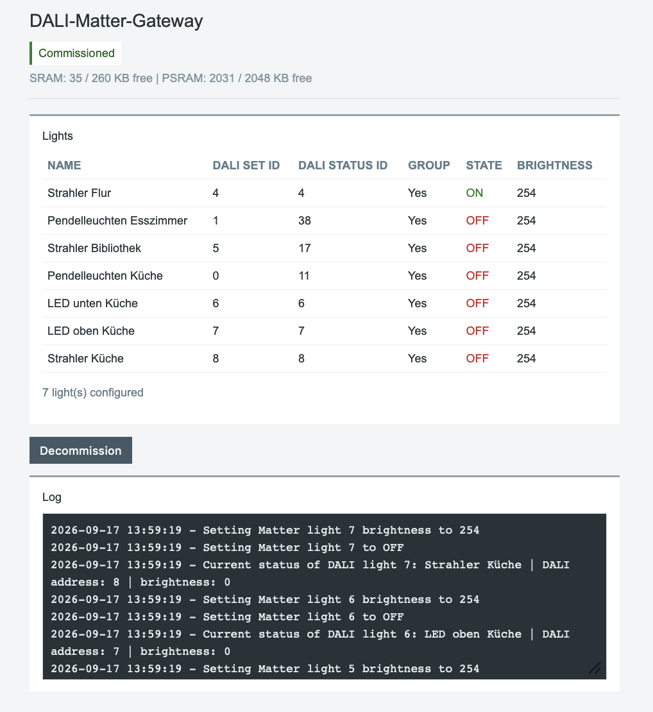

# DALI-Matter-Gateway

Copyright (C) 2026 Malte Rudolf

This program is free software: you can redistribute it and/or modify
it under the terms of the GNU General Public License as published by
the Free Software Foundation, either version 3 of the License, or
(at your option) any later version.

This program is distributed in the hope that it will be useful,
but WITHOUT ANY WARRANTY; without even the implied warranty of
MERCHANTABILITY or FITNESS FOR A PARTICULAR PURPOSE. See the
GNU General Public License for more details.

## About

Second version of the DALI-Matter-Gateway.

Controls DALI lights via Matter.

## Hardware

- Waveshare ESP32-S3-Pico
- Waveshare DALI2 Expansion Module

## Software

- Visual Studio Code
- pioarduino IDE
- Espressif32 Platform for PlatformIO (pioarduino fork)

## Features

- Control DALI lights through Matter
- Support for multiple Matter dimmable lights
- DALI device and group control
- Reading DALI light levels
- Logging of DALI traffic and gateway events in the web interface
- Web interface for status and control
- OTA firmware updates

## Configuration

The following files contain project-specific configuration and should not be committed to Git:

- `src/secrets.cpp` — Wi-Fi credentials
- `src/light_definitions.cpp` — local light configuration

These files are listed in `.gitignore`.

## Building

Open the project in PlatformIO and build the project using the configured environment.

The firmware can be uploaded via USB or OTA.

## Open Issues

- The Matter device still uses the example values for some commissioning data,
	including the example device information and serial number. The Matter QR
	code is also still generated from the example configuration and must be
	replaced with project-specific values.
- The current firmware supports approximately eight Matter lights. This limit
	is related to the current ESP32 Arduino Matter library implementation. A
	future library version is expected to use the ESP32's PSRAM more effectively
	and should allow this limit to be increased.

## Screenshots

## License

This project is licensed under the GNU General Public License version 3 or any later version (GPL-3.0-or-later).

See the `LICENSE` file for the complete license terms.

The software may be used, modified and distributed for both private and commercial purposes, subject to the conditions of the GNU General Public License.

## Third-Party Components

### DALI library

The project contains DALI library code originally developed by **qqqlab**.

Copyright © qqqlab

The original copyright and GPLv3+ license notices in the DALI library files have been retained.

The DALI library was obtained from the Waveshare DALI2 hardware/software package.

The applicable copyright and license conditions of the third-party software remain in effect.

## Disclaimer

This software is provided "AS IS", without warranty of any kind, express or implied.

The author provides no guarantee that the software is free of defects or suitable for any particular purpose.

To the extent permitted by applicable law, the author shall not be liable for any damage, data loss, hardware damage, financial loss, or other consequences resulting from the use of this software.

## Support and Maintenance

This project is provided without any obligation to provide support, maintenance, updates, bug fixes, or other services.

There is no guarantee that issues reported through GitHub Issues, Discussions, or other communication channels will be addressed.
